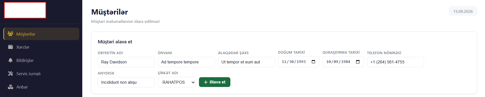
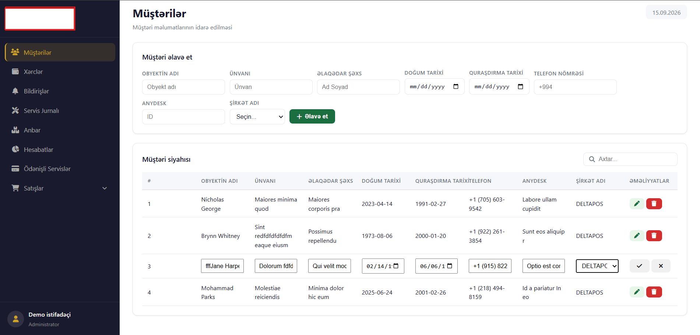
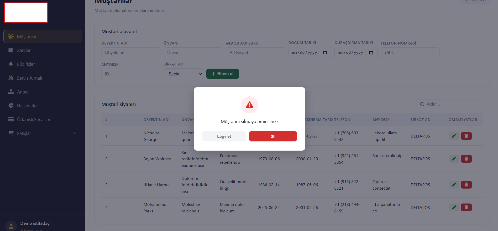

## Layihə haqqında

Bu layihəni monolit arxitektura əsasında hazırlayıram. Layihəni mərhələli şəkildə inkişaf etdirirəm və yeni funksiyalar hazır olduqca README faylını yeniləyirəm.

## İstifadə olunan texnologiyalar

* Java 21
* Spring Boot
* Spring Data JPA
* Hibernate
* Thymeleaf
* HTML
* CSS
* JavaScript
* PostgreSQL
* Liquibase
* Lombok
* Gradle

## Hazır funksiyalar

### Müştəri bölməsi

* Müştərinin əlavə edilməsi

* Müştərilərin siyahılanması
* Müştərinin redaktə edilməsi

* Müştərinin silinməsi

